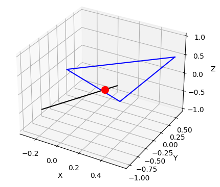

# Adversarial Attack Oriented 3D Object Detection based LiDAR

## How to Run

### Adversarial Attack Main Code

```bash
python main.py --DATA_PATH <your_dataset_path> --CKPT_PATH <pretained_model_path> --ROOFTOP_ANNOTATE <rooftop_estimate_parameters_path> --OPTIM rbboxloss --learning_rate 0.005 --overshoot 0.02
```

*Note: This code may not be up to date.*

### Ray Triangle Intersection

Following [johnnovak's project](https://github.com/johnnovak/raytriangle-test), I made some changes to calculate the intersection point between single ray, which can simulate one laser scan, and single triangle. This would be a starting point for solving the occlusion problem.




### Mesh Alignment

Refer to [here](./src/README_mesh_align.md) for more details.


